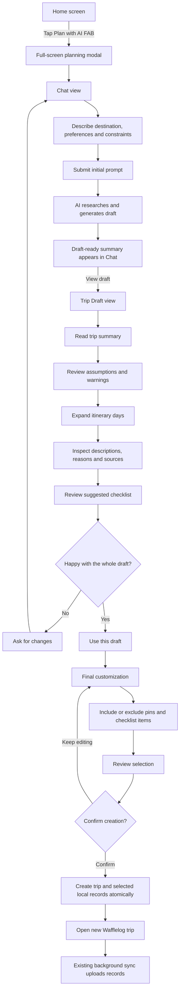

# AI Trip Planner UI Guide

## Purpose

The Trip Draft section is designed as a structured review workspace. It allows the user to understand the AI's proposal, inspect its assumptions and research, and either request another whole-draft revision or proceed to final customization.

The conversational Chat view remains responsible for collecting ideas and feedback. The Trip Draft view is responsible for presenting and reviewing the structured itinerary.

During conversational planning, the draft is read-only. Partial selections are introduced only after the user chooses `Use this draft`. This prevents temporary inclusion choices from being confused with instructions to the AI.

## Draft Components

### Trip Summary

The first card gives the user a quick orientation before they begin reviewing individual suggestions.

It displays:

- the draft revision number;
- the AI-generated trip title;
- the destination;
- the locally calculated dates and duration;
- a short explanation of the proposed style and pace.

Most of this information comes directly from `PlanningResult`. The calendar dates are calculated from the start date selected by the user.

Relevant API fields:

```text
PlanningJobCompleted.revisionNumber
PlanningResult.title
PlanningResult.destination
PlanningResult.durationDays
PlanningResult.summary
```

### Before You Decide

`Before you decide` is a collapsible information panel containing details the user should understand before accepting the itinerary.

It contains two kinds of information.

#### Assumptions

Assumptions are things the AI relied on while constructing the plan, for example:

- the traveller is staying near a central transport hub;
- the traveller is comfortable using public transport;
- the traveller is comfortable walking for a certain amount of time.

Relevant API field:

```text
PlanningResult.assumptions[]
```

#### Warnings

Warnings identify details that the traveller should verify, for example:

- restaurant opening days;
- reservation requirements;
- seasonal closures;
- admission rules;
- availability that may change before travel.

Relevant API field:

```text
PlanningResult.warnings[]
```

The panel is collapsed initially because this information is important but should not visually compete with the itinerary. The badge displays the combined number of assumptions and warnings.

These details should survive the eventual import, most likely as a trip-level note.

### Your Itinerary

`Your itinerary` is the main review area.

Its heading displays:

- the total number of suggestions in the draft;
- guidance explaining that the user can inspect the itinerary before deciding whether to revise it or use it.

#### Day Groups

Suggestions are grouped using the API's `days[]` structure.

Each day displays:

- the day number;
- the calculated calendar date;
- the AI-generated day title;
- the AI-generated day description;
- the number of suggestions for that day;
- an expand or collapse control.

For example:

```text
Day 1 · Mon 12 Oct
Markets and old Osaka
Ease in with local food and a lantern-lit evening walk.
```

Relevant API fields:

```text
DraftDay.dayNumber
DraftDay.title
DraftDay.description
DraftDay.items[]
```

The calendar date is derived locally:

```text
selected start date + dayNumber - 1 day
```

The descriptive day title is returned by the API. It does not require a new Wafflelog database field or a persisted day entity.

After import, the selected suggestions become pins. The existing application naturally groups those pins by their calculated dates.

#### Itinerary Suggestions

Each itinerary item displays:

- a suggested start time;
- a normalized Wafflelog category;
- the suggestion title;
- a short description.

Relevant API fields:

```text
DraftItem.draftId
DraftItem.type
DraftItem.suggestedStartTime
DraftItem.category
DraftItem.title
DraftItem.description
```

During conversational review, itinerary suggestions are read-only. The user can expand the supporting research, but cannot partially accept items at this stage.

The category shown in the UI is normalized into one of Wafflelog's supported categories:

```text
attraction
food
stay
shopping
nature
transport
event
other
```

Unknown AI categories fall back to `other`. The user should eventually be able to correct the category before import.

#### Why This Place?

`Why this place?` expands the supporting information for an individual suggestion.

It displays:

- why the AI recommended the suggestion;
- the research sources used for it;
- an indication when no source link is attached.

Relevant API fields:

```text
DraftItem.reason
DraftItem.sources[].title
DraftItem.sources[].url
```

Keeping this information collapsed makes the default itinerary easier to scan while still making the AI's recommendations inspectable.

### Final Customization

After the user is happy with the complete AI draft, they select `Use this draft`. This begins a separate final customization step.

During final customization, the user can:

- include or exclude individual itinerary suggestions;
- include or exclude checklist suggestions;
- review the number of records that will be created;
- return to the read-only draft without saving the temporary choices;
- continue to final confirmation.

These choices are local UI state only. They are not sent to the refinement API and do not influence a later AI revision.

If the user returns to Chat and requests another revision, the AI revises the complete current draft using the freeform feedback message. When the new revision arrives, any previous customization choices are discarded and the new revision returns to the read-only review state.

No Wafflelog trip, pin, note, link, location, or checklist record is created during customization. Records are created only after final confirmation, inside one local SQLite transaction.

### Suggested Checklist

The `Suggested checklist` section contains practical preparation tasks proposed by the AI, for example:

- reserve a restaurant;
- set up a transport card;
- pack appropriate footwear;
- confirm opening dates.

Relevant API field:

```text
PlanningResult.checklistSuggestions[].title
```

In the read-only draft, checklist suggestions are presented for inspection. In final customization, each checklist suggestion gains an inclusion control. Selected suggestions become Wafflelog checklist items only after final confirmation.

### Bottom Actions

Two actions remain available at the bottom of the Trip Draft view.

#### Ask for Changes

This action returns the user to Chat and prepares them to describe a broader revision, for example:

```text
Could you make day two a little less busy?
```

Submitting that feedback creates a new planning job and, when complete, a new draft revision.

Any final customization choices are absent at this point, so there is no partial selection state to reconcile with the new AI revision.

#### Use This Draft

This action indicates that conversational revision is finished and opens final customization.

It does not create or persist a trip. It only enables local inclusion controls for itinerary and checklist suggestions.

### Final Customization Actions

#### Back to Draft

This returns to the read-only Trip Draft view and discards the temporary inclusion choices.

#### Review Selection

This opens the final confirmation summary using the user's current inclusion choices.

The final review should eventually summarize:

- trip title and dates;
- number of selected pins;
- number of checklist items;
- number of notes and links;
- any unresolved warnings;
- the records that will be created.

The current prototype dialog is intentionally simpler because it does not create records.

## User Flow



## Two Types of Revision

The design intentionally supports two different forms of revision.

### Conversational Revision

The user asks the AI to reconsider or redesign part of the itinerary.

Examples:

- make a day less busy;
- replace a museum with a garden;
- reduce walking;
- add more independent restaurants;
- change the overall pace.

This creates a new AI planning job and eventually a new draft revision.

Conversational refinement always operates on the complete current draft. The existing API accepts a freeform feedback message and has no structured concept of locked, accepted, or rejected draft items.

### Final Local Customization

After selecting `Use this draft`, the user makes small import decisions without asking the AI to regenerate the plan.

Examples:

- exclude one attraction;
- exclude a checklist suggestion;
- change a pin category;
- adjust a suggested time;
- retain only selected sources.

These changes should be immediate and stored as local review state.

These temporary selections are not persisted as Wafflelog content. Only final confirmation materializes the selected records.

This distinction avoids API changes and makes the interface more predictable: genuine itinerary redesign returns to the conversation, while item-level inclusion happens only when preparing the final import.

## API and Local Data Responsibilities

The API provides:

- the planning conversation;
- draft revisions;
- trip summary and destination;
- assumptions and warnings;
- day groups;
- itinerary suggestions;
- reasoning and sources;
- checklist suggestions;
- general reference links.

The frontend provides:

- the selected start date;
- calculated calendar dates;
- expanded and collapsed UI state;
- temporary final-customization selections;
- normalized Wafflelog categories;
- final edits;
- local record creation;
- navigation to the created trip.

Wafflelog's database does not need a new day entity. The selected itinerary items become pins with dates, and the existing trip interface groups those pins by day.

## Prototype Status

The current prototype demonstrates:

- the Chat and Trip Draft split;
- mock conversational messages;
- draft navigation;
- collapsible days;
- a read-only conversational draft;
- a separate final-customization step for included and excluded suggestions;
- expandable reasoning and sources;
- assumptions and warnings;
- checklist suggestions;
- a final review dialog.

It does not currently:

- call the AI planning API;
- poll a planning job;
- persist a planning session;
- submit refinements;
- import a trip;
- create pins, notes, links, locations, or checklist items.

Those integration steps should begin only after the prototype interaction and visual design are accepted.
